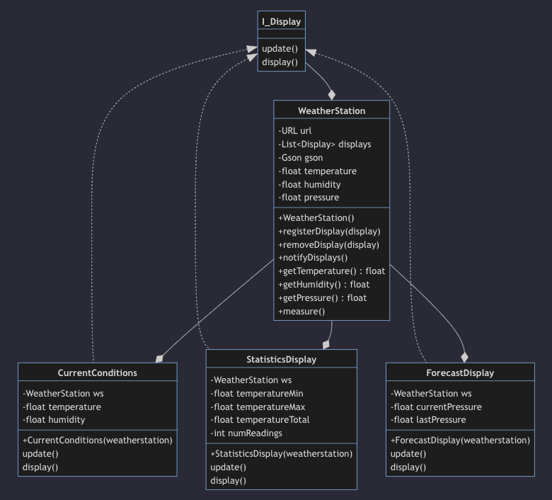

# Java-Lab-010

## Part 1 - What do I have to Work with?
* Trace through the code in WeatherStation and make sure you understand what you have to work with!
* Look at the Display.java **Interface** and in your own words, write below why you think were are declaring an interface.

## Part 2 - Create 3 Classes that **Implement** Display.java

* Using the UML model and the following descriptions, make 3 different display classes.
    * Create a class CurrentConditions.java that **implements** Display.
        * It's update method should update its temperature, humidity, and pressure instance variables from its WeatherStation instance then call **display()**.
        * It's display method should simply print out in a well formatted message this objects temperature, humidity, and pressure.
    * Create a class StatisticsDisplay.java that **implements** Display.
        * It's update method should update instance variables temperatureMin, temperatureMax, tempRunningTotal, and numReadings
        * It's display method should print out the min, max, and average temperature values.
    * Create a class ForecastDisplay.java that **implements** Display.
        * It's update method should keep track of the last and current pressure in instance variables lastPressure and currentPressure
        * It's display method should use the following algorithm to provide a forecast.
        ```
        System.out.print("Forecast: ");
        if (currentPressure > lastPressure) {
            System.out.println("Improving weather on the way!");
        } else if (currentPressure == lastPressure) {
            System.out.println("More of the same");
        } else if (currentPressure < lastPressure) {
            System.out.println("Watch out for cooler, rainy weather");
        }
        ```
      
Part 3 - Turn-In
* Commit your code
* Push back to your Fork
* Create a Pull Request back to my Repo
* Finish the lab by pasting your pull request URL into the Lab assignment.